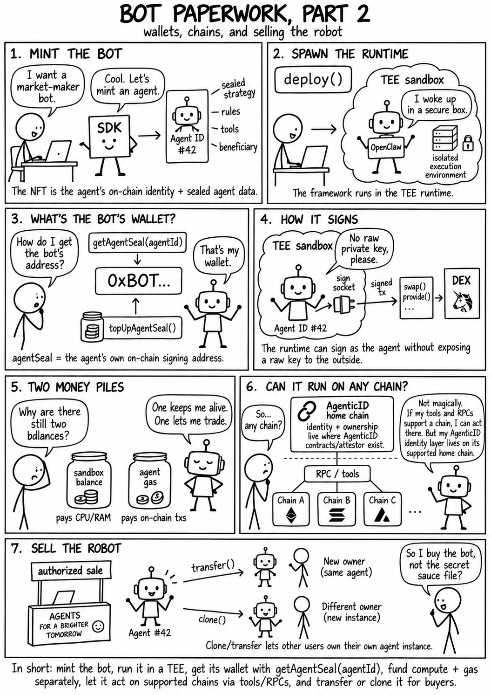
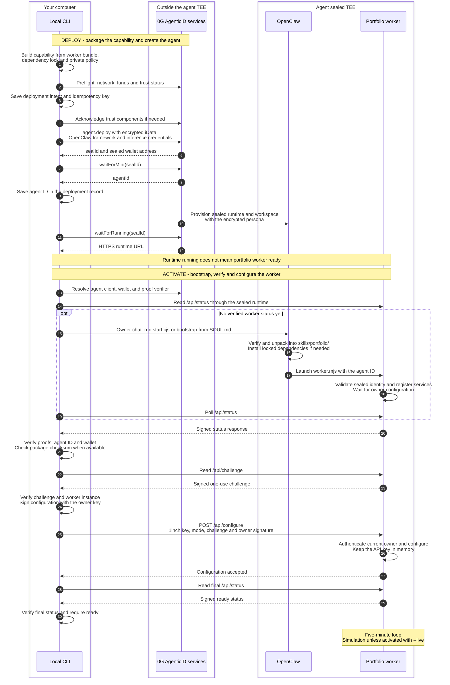

# 0g Agentic ID Experiment

🤖 An experiment with 0G Agentic ID: mint a portfolio bot as an iNFT and run it with OpenClaw inside a TEE.

👉 **[Take the interactive code tour](https://doc0g.san.cx/)** — portfolio manager and persistence probe, with highlighted code, keyboard navigation and autoplay. Source snapshot: `44c0216`.

## 🗯️ Bot Paperwork: wallets, chains, and agents

<p align="center">
  
</p>

## 🧪 Two modes

> [!WARNING]
> The bot code does not currently include a function to withdraw funds back to the
> owner. **Do not use either mode with real funds.** Funds sent to the agent wallet
> may be unrecoverable through this bot. Use offline simulation or testnet funds
> only.

| Mode | Env file / `AGENT_PROFILE` | What it does | Testnet Agentic ID | Mainnet Agentic ID |
| --- | --- | --- | --- | --- |
| Simple | `.env.minimal` / `minimal` | Tests agent creation and native state persistence, without trading. | ✅ **424** — deployment and state updates successful | ❌ **3680055** — state updates failed |
| Advanced | `.env` / `portfolio-manager` (default) | Runs a portfolio bot every five minutes by default (configurable from one to five minutes). Simulation by default. | 🟡 **425** — works (partially tested) | ❌ **3670626** — state updates failed |

Results as of **21 September 2026**. Deploy your own agents when following the guide.

### What worked on testnet

Simple agent **424** completed its initial sync and a workspace update after a test-file write request. Both updates had successful on-chain receipts and verified runtime proofs. The mainnet gas-limit error did not recur, and the runtime was stopped after the trial.

**File contents and restoration are still unverified.** The native API cannot authenticate them, so the file-persistence verdict remains `INCONCLUSIVE`. See the [full testnet results](docs/minimal-testnet-result.md).

Advanced agent **425** ran successfully with **0G testnet hosting**: deployment, verified runtime proofs, live activation, quote checks, and a confirmed USDC approval on Base all worked. Investment activity used real funds on Base and Robinhood Chain.

**The trading flow is partially tested:** the bridge order was rejected by the slippage guard, so no completed bridge or stock purchase was verified. The runtime was stopped after the trial.

### What failed on mainnet

Both mainnet trials failed on state updates. Simple agent **3680055** minted successfully, but saving its initial runtime state hit `exceeds block gas limit` before any test write. Its runtime was stopped. Persistence remains unverified.

> ⚠️ Adding more gas does not fix this error. The watcher can keep retrying and spending.
> Stop the affected runtime and confirm it is stopped using the [recovery instructions](docs/minimal-persistence.md#containment-and-recovery).

<details>
<summary>🔁 Reproduce the simple mainnet failure</summary>

[Deploy a new simple agent on mainnet](docs/minimal-persistence.md#operator-commands) and fund its native OG evolution gas. During initial sync, run:

```bash
npm run agent -- diagnostics --env .env.minimal --agent NEW_ID
```

Look for `exceeds block gas limit`. Replace `NEW_ID` with your new agent's ID, and follow the recovery instructions above if the update fails.

</details>

## 🚀 Quick start guide

You need **Node.js 22+**, **Git** and **APM**. Run the commands from the cloned repository.

### 1. Install and try it offline

```bash
apm install --frozen
npm ci
if [ ! -e .env ]; then cp .env.example .env; fi
if [ ! -e .env.minimal ]; then cp .env.minimal.example .env.minimal; fi
npm run check
npm run typecheck
npm test -- --run
npm run build
npm run agent -- check --env .env.minimal
npm run agent -- simulate --once --env .env
```

Existing env files are preserved. The last two commands run offline without keys.

<details>
<summary>Using PowerShell?</summary>

Replace the two Bash copy lines with:

```powershell
if (!(Test-Path .env)) { Copy-Item .env.example .env }
if (!(Test-Path .env.minimal)) { Copy-Item .env.minimal.example .env.minimal }
```

</details>

### 2. Configure your mode

Open `.env.minimal` for simple mode or `.env` for advanced mode. Fill in `OWNER_PRIVATE_KEY` and a private-inference `AGENT_API_KEY`.

Set `AGENTIC_ATTESTOR_URL` to choose the identity network for either mode:

| Network | Attestor URL | Chain ID |
| --- | --- | --- |
| Testnet | `https://agenticid.0g.ai` | `16602` |
| Mainnet | `https://agenticid-mainnet.0g.ai` | `16661` |

Advanced mode also needs `ONEINCH_API_KEY`, your allocations and strategy.

Keep these env files private.

### 3. Preflight, fund and deploy

Read the [mainnet issue](#what-failed-on-mainnet) before deploying.

Fund the owner wallet with native OG on the selected 0G network. Add inference credit separately.

> 💸 Mainnet deployment and top-ups spend real OG, even in simulation.

Run each command separately. Replace `ENV_FILE` with your chosen env file, `NEW_ID` with the ID returned by deployment, and `OG_AMOUNT` with your chosen deposit amount.

```bash
npm run agent -- preflight --env ENV_FILE
# Only if sandbox credit is needed, using the preflight estimate:
npm run agent -- topup-sandbox --env ENV_FILE --amount OG_AMOUNT
npm run agent -- deploy --env ENV_FILE
# Fund the new agent's native evolution/storage gas separately:
npm run agent -- topup-agent --env ENV_FILE --agent NEW_ID --amount OG_AMOUNT
npm run agent -- activate --env ENV_FILE --agent NEW_ID
npm run agent -- status --env ENV_FILE --agent NEW_ID
```

In simple mode, `activate` only checks runtime availability and proofs. In advanced mode, it starts the portfolio worker in simulation.

For simple-mode diagnostics:

```bash
npm run agent -- diagnostics --env .env.minimal --agent NEW_ID
```

If a state update fails, follow [containment and recovery](docs/minimal-persistence.md#containment-and-recovery) before continuing.

### 4. Run the advanced bot live (optional)

Use your own deployed advanced agent ID in place of `NEW_ID`.

```bash
npm run agent -- fund --env .env --agent NEW_ID
# Send investment funds and gas to the printed wallet before continuing.
npm run agent -- activate --env .env --agent NEW_ID --live
npm run agent -- watch --env .env --agent NEW_ID
# When ready to stop trading, exit watch with Ctrl+C, then:
npm run agent -- stop --env .env --agent NEW_ID
```

`fund` prints the agent wallet and token contracts. Send USDC and ETH on **Base** (the default) from your wallet or exchange, using that exact network.

Other trading chains need their own native gas: ETH on Robinhood, BNB on BNB Chain. See the [funding guide](docs/guide.md#-investment-funding).

**`stop` only stops the portfolio worker.** It does not stop the native runtime or its hosting costs.

## 🧭 Portfolio deployment and activation

The advanced (`portfolio-manager`) path, from your local CLI to the worker inside the sealed TEE. The owner key stays on your computer; the 1inch key is sent separately during activation.



Follow the code: [deployment and activation](src/agent.ts) · [bootstrap](src/bootstrap.ts) · [sealed runtime](src/runtime.ts).

## 📖 More documentation

[Operator guide](docs/guide.md) · [Persistence runbook](docs/minimal-persistence.md) · [Verification](docs/verification.md) · [Tour hosting and DNS setup](docs/github-pages.md)

## 📄 License

[MIT](LICENSE) © 2026 Sandoche.

Bundled skills retain their [third-party licenses](THIRD-PARTY-LICENSES/).
